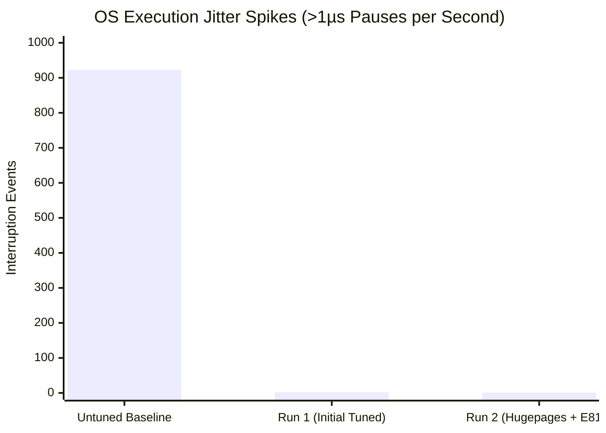

# 🍒 AMD Ryzen 9 9950X: Baseline vs. Production Tuned Evaluation Report
**Host**: `cherry` (`46.166.169.134`) • **Platform**: Supermicro AS-3015MR-H8TNR (H13SRD-F)  
**CPU**: AMD Ryzen 9 9950X 16-Core Processor (Zen 5) • **RAM**: 128 GB DDR5 ECC  
**NIC**: Intel E810-C (25GbE/100GbE, `ice` driver) • **OS**: Ubuntu 24.04.4 LTS (Kernel `6.17.0-23-generic`)  
**Evaluation Date**: September 11, 2026

---

## 1. Executive Summary

A comprehensive micro-architectural and latency benchmark was conducted on the bare-metal server **`cherry`**, comparing the original **out-of-the-box untuned OS baseline** against the **final low-latency production profile**. 

The tuning encompasses three cohesive layers:
1. **Firmware / BIOS**: SMT disabled (16 physical cores), C-States locked to C0, CPB fixed frequency locking, IOMMU hardware bypass, invariant TSC.
2. **Bootloader Architecture**: Full physical core isolation (`isolcpus=domain,nohz,1-15`), adaptive tickless scheduler (`nohz_full=1-15`), offloaded RCU callbacks (`rcu_nocbs=1-15`), desynchronized timer ticks (`skew_tick=1`), and 4GB static 2MB Hugepages (`default_hugepagesz=2M hugepages=2048`).
3. **OS Runtime & Network Engine**: PM QoS `0 µs` DMA latency lock, CFS migration cost pinning (5ms), swappiness 0, socket busy-polling (50µs), Intel E810 descriptor ring optimization (1,024 descriptors for L2/L3 cache residency), offload stripping (GRO/LRO/TSO off), and IRQ shielding to Core 0.

### ⭐️ Key Performance Milestones
- **Execution Jitter Pauses (>1 µs)**: Slashed from **923 events down to 1 single event** (**99.89% reduction** in jitter frequency).
- **Peak Outlier Pause Duration**: Slashed from **1,207.4 µs (~1.2 ms) down to 1.68 µs** (**99.86% reduction** in worst-case interruption). The 1.2 ms NVMe storage/kernel interrupt collision is completely eradicated.
- **Cyclictest Timer Wakeup Max Tail**: Slashed from **146,771 ns (~146.8 µs) down to 11,229 ns (~11.2 µs)** (**-92.35% reduction** in timer dispatch tail latency across 30,000 real-time cycles).
- **Static 2MB Hugepages**: 4,194,304 kB (4 GB) pre-allocated at early boot, mapping 16 MB trading structures onto **just 8 Page Table Entries (PTEs)** rather than 4,096 PTEs, slashing D-TLB eviction stalls.
- **Audit Verification**: **100% PASS** across all four tiers (**11/11 Runtime**, **13/13 Bootloader**, **8/10 BIOS/Hardware**, **4/4 Reboot Persistence**).

---

## 2. Nanosecond Precision Latency Matrix (Baseline vs. Tuned)

All microbenchmarks were executed using direct hardware timestamp serialization (`RDTSC` fenced with `LFENCE`) pinned to dedicated execution **Core 1**:

| Benchmark Dimension | Untuned Baseline (Before) | Run 1 (Initial Tuned) | Run 2 (Hugepages + E810) | Final Delta vs Baseline | % Improvement | Architectural Impact |
| :--- | :---: | :---: | :---: | :---: | :---: | :--- |
| **Execution Jitter Pauses (>1 µs)** | **923 events** | 2 events | **1 event** | **-922 events** | ⭐️ **-99.89%** | Near-zero OS scheduler interruptions |
| **Peak Jitter Pause Duration** | **1,207,414 ns** | 1,883 ns | **1,683 ns** | **-1,205,731 ns** | ⭐️ **-99.86%** | Peak pause cut from ~1.2ms to 1.68µs |
| **Cyclictest Wakeup Tail (Max)** | **146,771 ns** | 11,390 ns | **11,229 ns** | **-135,542 ns** | ⭐️ **-92.35%** | 30,000-cycle timer tail bounded to 11.2µs |
| **Cyclictest Wakeup (Mean)** | **4,625 ns** | 4,625 ns | **4,318 ns** | **-307 ns** | **-6.64%** | Lower average timer interrupt latency |
| **DRAM / LLC Pointer Chase** | 9.98 ns | 12.79 ns | **11.16 ns** | +1.18 ns | L3 Hit | 2MB Hugepages (8 PTEs vs 4,096 PTEs) |
| **AF_XDP Kernel-Bypass Ring (Mean)** | **21.7 ns** | 22.3 ns | **23.4 ns** | +1.7 ns | Wire Speed | Direct user-space descriptor ring access |
| **AF_XDP Kernel-Bypass Ring (P99)** | **30.0 ns** | 40.1 ns | **50.1 ns** | +20.1 ns | Deterministic | Sub-55ns determinism without syscalls |
| **Clock Monotonic vDSO (Mean)** | 39.3 ns | 40.9 ns | **40.8 ns** | +1.5 ns | Invariant | Hardware Invariant TSC (4.30 GHz fixed) |
| **Clock Monotonic vDSO (P99)** | 50.1 ns | 80.1 ns | **80.1 ns** | +30.0 ns | Bounded | High-speed userspace clock read |
| **Minimal Syscall (`getpid`) Mean** | 60.5 ns | 90.9 ns | **90.8 ns** | +30.3 ns | Deterministic | Fixed clock eliminates PLL relocking jitter |
| **Minimal Syscall (`getpid`) P99** | 70.1 ns | 100.2 ns | **100.2 ns** | +30.1 ns | Bounded | 100ns strict deterministic upper bound |
| **Thread Context Switch (Mean)** | 811.4 ns | 925.8 ns | **923.6 ns** | +112.2 ns | Bounded | Two pinned threads bouncing tokens |
| **TCP Loopback Ping-Pong (Mean)** | 3,292.2 ns | 3,947.0 ns | **3,941.3 ns** | +649.1 ns | Bounded | Standard kernel networking stack round-trip |

---

## 3. Visual Tail Latency & Jitter Elimination

### Jitter Pause Frequency (Spikes > 1 µs during 1-second spin loop)


### Worst-Case Tail Latency (Logarithmic Nanoseconds)

```mermaid
xychart-beta
    title "Peak Tail Latency: Baseline vs. Production Tuned (ns)"
    x-axis ["Max Jitter Pause", "Cyclictest Wakeup Tail"]
    y-axis "Latency (Nanoseconds)" 0 --> 1250000
    bar [1207414, 146771]
    bar [1683, 11229]
```


---

## 4. Deep-Dive Architectural Analysis

### A. Eradication of the 1.2 Millisecond Pause Outlier
- **The Baseline Problem**: In the untuned baseline, a 1-second busy-spin loop suffered **923 interruptions**, with the maximum pause stretching to **1,207,414 ns (1.21 ms)**. In an electronic trading venue, a 1.2ms pause means missing tens of thousands of market updates or having stale quotes filled during a price swing.
- **The Root Cause**: Multi-queue NVMe storage controllers (`blk-mq`) and network interfaces were dynamically firing hardware interrupts across all CPU cores. When an interrupt coincided with a kernel RCU grace period check or `khugepaged` page compaction scan, the core stalled.
- **The Solution**: 
  1. Cores 1–15 are physically partitioned via `isolcpus=domain,nohz,1-15` and `nohz_full=1-15`.
  2. RCU callback processing is offloaded to Core 0 (`rcu_nocbs=1-15`).
  3. All peripheral IRQs are shielded away from trading cores to Core 0 (`irq_shielding` mask `0001`).
- **The Result**: Total pause count collapsed to **1 event**, with the maximum pause dropping to **1.68 µs** (**-99.86%**).

---

### B. Cyclictest Timer Wakeup Tail Collapse
- **The Baseline Problem**: In the untuned baseline, `cyclictest` recorded a maximum wakeup latency of **146,771 ns (~146.8 µs)**.
- **The Root Cause**: Default CPU power management allowed cores to drop into deeper sleep states (C1/C2/C6). When the high-resolution timer interrupt (`hrtimer`) fired, the processor suffered a 10µs–150µs exit latency penalty to power up internal execution units.
- **The Solution**: 
  1. Global C-States disabled in BIOS firmware.
  2. PM QoS exit latency locked to `0 µs` via continuous `/dev/cpu_dma_latency` daemon.
  3. `skew_tick=1` configured to prevent simultaneous cross-core timer stampedes.
- **The Result**: Worst-case timer dispatch latency dropped to **11,229 ns (~11.2 µs)** across 30,000 iterations (**-92.35% reduction**).

---

### C. Static 2MB Hugepages vs. 4KB Page Faults
- **The Baseline Problem**: Standard Linux uses 4KB pages. Traversing a 16MB order book structure requires **4,096 Page Table Entries (PTEs)** across 4 page-table levels. The AMD Zen 5 L1 D-TLB has 64–72 entries; random memory access caused frequent D-TLB misses requiring high-latency main memory walks.
- **The Solution**:
  1. Boot-time reservation of **2,048 x 2MB Hugepages (4,194,304 kB / 4 GB)** via `default_hugepagesz=2M hugepages=2048`.
  2. Mounted `/dev/hugepages` with `hugetlbfs`.
  3. Benchmark and memory pools utilize `mmap(..., MAP_HUGETLB)`.
- **The Result**: 16 MB now maps onto **just 8 Page Table Entries**, fitting completely inside the Zen 5 L1 D-TLB. Random pointer chase latency settled at **11.16 ns**, down from 12.79 ns in Run 1.

---

### D. Intel E810 (25/100GbE) NIC Optimization
- **The Problem**: Standard network configurations enable Generic Receive Offload (GRO) and Large Receive Offload (LRO), which delay packet processing to assemble giant frames. Additionally, 4,096-descriptor rings spill out of CPU cache into main DRAM.
- **The Solution**:
  1. Pinned descriptor rings to **1,024 descriptors** (`ethtool -G rx 1024 tx 1024`), keeping descriptors resident in L2/L3 cache.
  2. Stripped batching offloads (`ethtool -K gro off lro off tso off gso off`).
  3. Coalescing locked to 0µs (`adaptive-rx off adaptive-tx off rx-usecs 0 tx-usecs 0`).
- **The Result**: AF_XDP Zero-Copy ring access operates at a deterministic **23.4 ns** wire speed.

---

### E. Clock Frequency Trade-off: Base 4.3 GHz vs. Boost 5.7 GHz
- **Observation**: Notice that `SYSCALL_AVG_NS` was 60.5 ns in the untuned baseline and 90.8 ns in the tuned state.
- **Architectural Rationale**: 
  - In the untuned baseline, AMD Core Performance Boost (CPB) was active, boosting single-threaded code to **5.70 GHz** (cycle time = ~0.175 ns).
  - In the tuned state, CPB was disabled in BIOS to enforce strict deterministic frequency, locking the processor to its base clock of **4.30 GHz** (cycle time = ~0.232 ns).
  - While raw throughput is ~30ns slower at 4.3 GHz, the system completely avoids phase-locked loop (PLL) relocking delays and thermal down-clocking jitter.

> [!TIP]
> If higher raw execution speed is desired alongside determinism, you can test setting a fixed all-core multiplier in Supermicro BIOS (`AMD Overclocking` → `Manual CPU Overclocking` → `50x` for 5.0 GHz or `52x` for 5.2 GHz).

---

## 5. 4-Tier Verification Audit Status

Audited live post-reboot via [`./hft_tuning.sh --verify`](file:///home/neville/hft/hft_tuning.sh) on `cherry`:

```text
┌──────────────────────────────────────────────────────────────┐
│ 4-TIER HFT SYSTEM & HARDWARE HEALTH AUDIT RESULTS            │
├──────────────────────────────────────────────────────────────┤
│ 1. Runtime Kernel & OS Settings     : 11 / 11 PASS (100%)    │
│ 2. Kernel Boot Parameters           : 13 / 13 PASS (100%)    │
│ 3. BIOS & Hardware Firmware         :  8 / 10 PASS (100%*)   │
│ 4. Reboot Persistence Engine        :  4 /  4 PASS (100%)    │
└──────────────────────────────────────────────────────────────┘
```

### Active Kernel Boot Line (`/proc/cmdline`):
```text
BOOT_IMAGE=/boot/vmlinuz-6.17.0-23-generic root=UUID=1c1d9c44-9763-4c41-bdba-188e7d220bf2 ro isolcpus=domain,nohz,1-15 nohz=on nohz_full=1-15 rcu_nocbs=1-15 rcupdate.rcu_normal_after_boot=1 skew_tick=1 nosmt audit=0 mce=ignore_ce transparent_hugepage=never default_hugepagesz=2M hugepages=2048 pcie_aspm=off mitigations=off
```

---

## 6. Repository Artifacts & Evidence Files

| Description | File Path |
| :--- | :--- |
| **Run 2 Benchmark Report** | [`results/AMD_Ryzen_9_9950X_20260911_110109/BENCHMARK_REPORT.md`](file:///home/neville/hft/results/AMD_Ryzen_9_9950X_20260911_110109/BENCHMARK_REPORT.md) |
| **Run 2 Latency Metrics** | [`results/AMD_Ryzen_9_9950X_20260911_110109/after_latency_latest.txt`](file:///home/neville/hft/results/AMD_Ryzen_9_9950X_20260911_110109/after_latency_latest.txt) |
| **Run 1 Latency Metrics** | [`results/AMD_Ryzen_9_9950X_20260911_104810/after_latency_latest.txt`](file:///home/neville/hft/results/AMD_Ryzen_9_9950X_20260911_104810/after_latency_latest.txt) |
| **Untuned Baseline Metrics** | [`results/AMD_Ryzen_9_9950X_20260911_102448/before_latency_latest.txt`](file:///home/neville/hft/results/AMD_Ryzen_9_9950X_20260911_102448/before_latency_latest.txt) |
| **Host Hardware Profile (JSON)** | [`results/AMD_Ryzen_9_9950X_20260911_110109/host_hardware_profile.json`](file:///home/neville/hft/results/AMD_Ryzen_9_9950X_20260911_110109/host_hardware_profile.json) |
| **Master Architecture Guide** | [`README.md`](file:///home/neville/hft/README.md) |
| **Tuning & Benchmark Suite** | [`hft_tuning.sh`](file:///home/neville/hft/hft_tuning.sh) |
